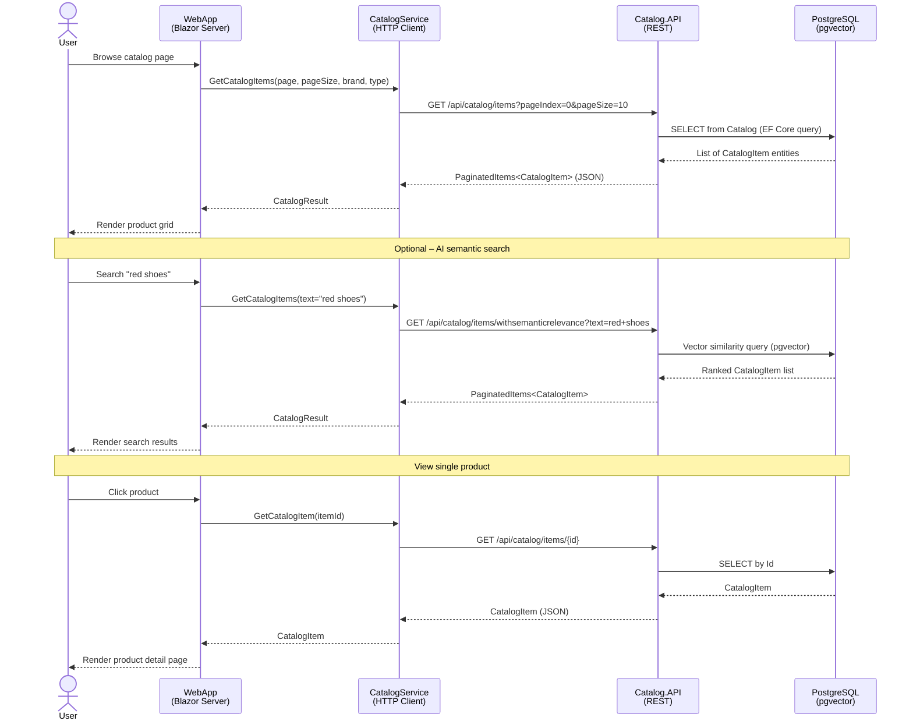
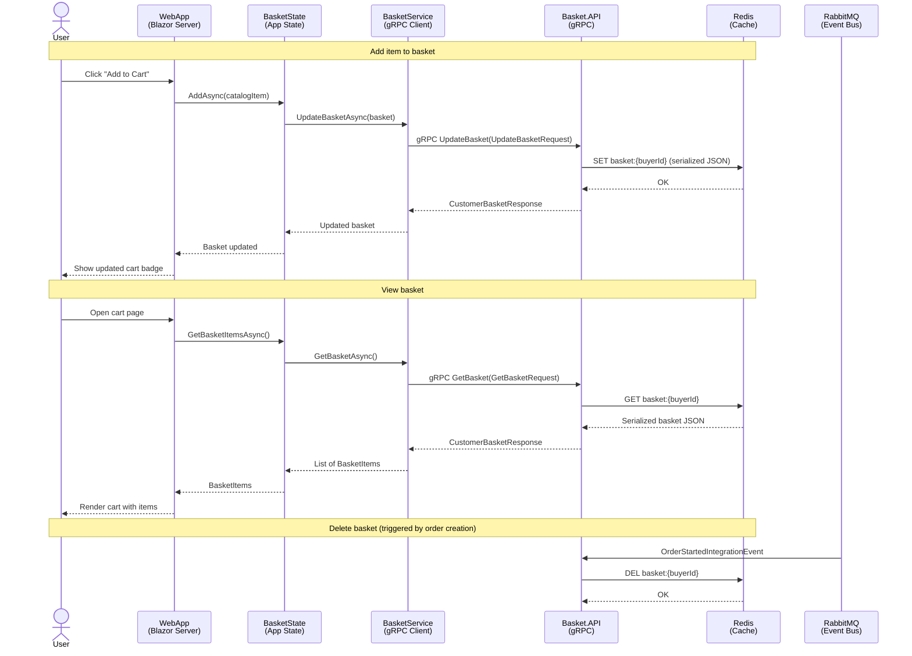
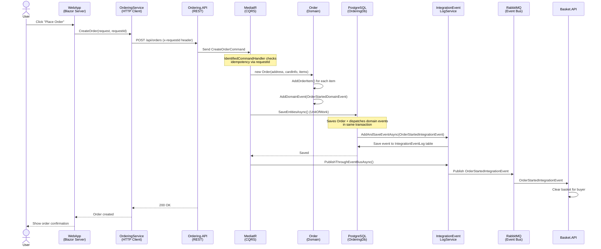
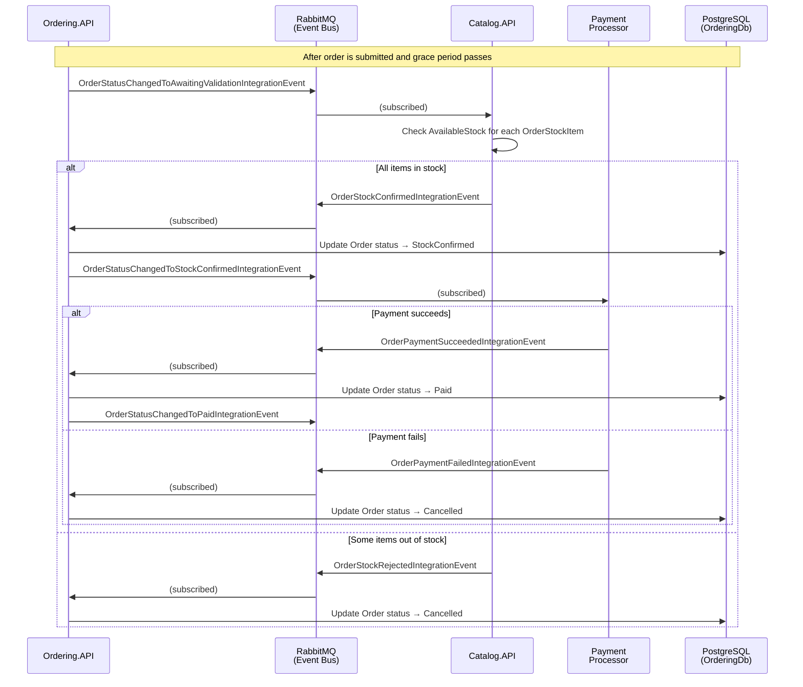
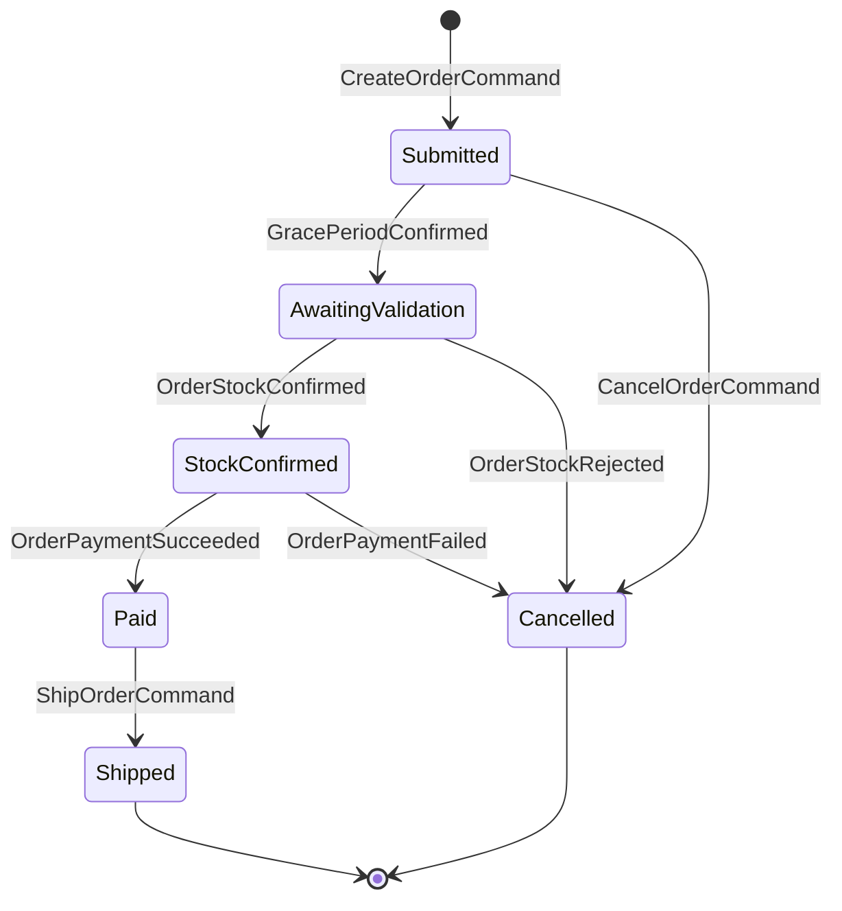
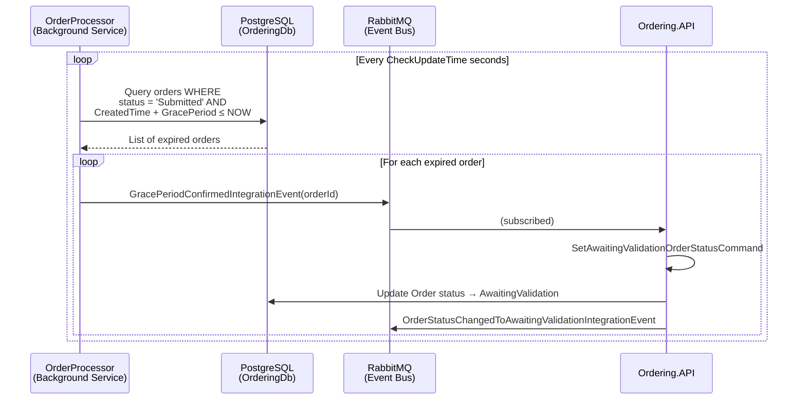
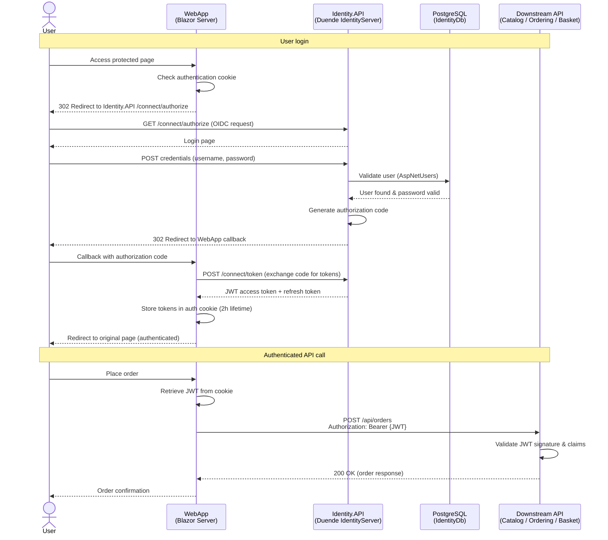
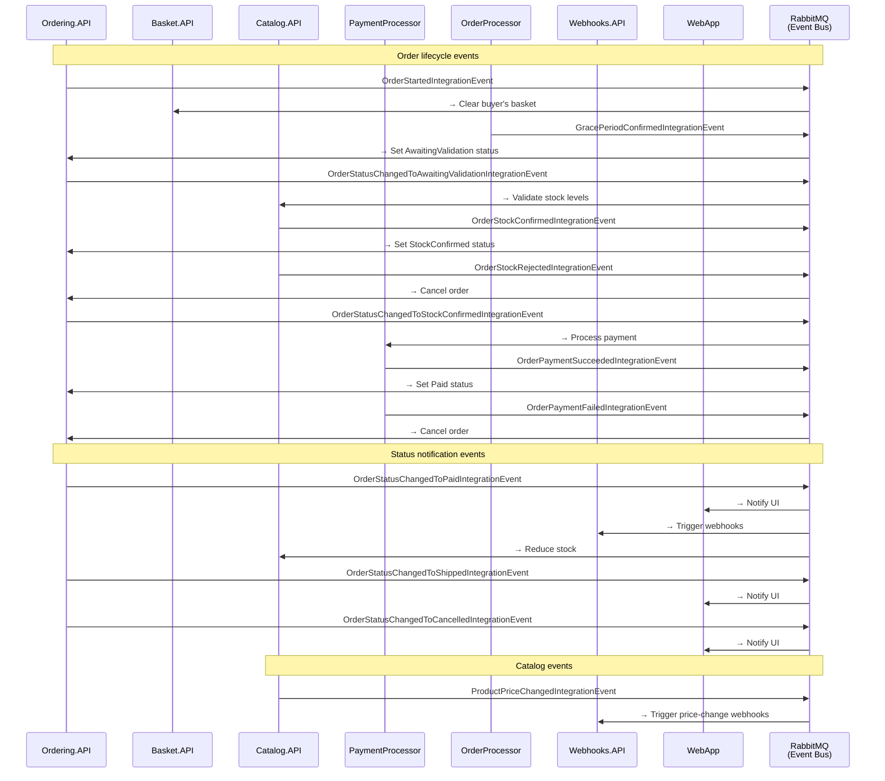
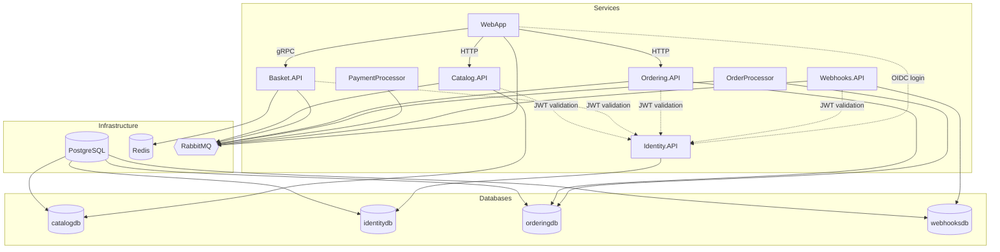

# eShop Sequence Diagrams

This document contains sequence diagrams for the major flows in the eShop
reference application. All diagrams use [Mermaid](https://mermaid.js.org/)
syntax and render natively on GitHub.

---

## Table of Contents

1. [Catalog Browsing Flow](#1-catalog-browsing-flow)
2. [Basket / Cart Management Flow](#2-basket--cart-management-flow)
3. [Order Placement & Processing Flow](#3-order-placement--processing-flow)
4. [Order Grace Period Flow](#4-order-grace-period-flow)
5. [Authentication Flow](#5-authentication-flow)
6. [Integration Events Overview](#6-integration-events-overview)

---

## 1. Catalog Browsing Flow

The user browses the product catalog through the Blazor WebApp, which calls the
Catalog REST API. The API queries PostgreSQL (with pgvector for AI-powered
semantic search).

---

## 2. Basket / Cart Management Flow

The basket service uses **gRPC** for communication between the WebApp and
Basket.API, and **Redis** for persistence. When an order is placed, an
integration event clears the basket.

---

## 3. Order Placement & Processing Flow

This is the most complex flow in the application, spanning multiple services and
using **CQRS**, **Domain Events**, **Integration Events**, and the
**Transactional Outbox** pattern.

### 3a. Order Creation

### 3b. Stock Validation & Payment Processing

### 3c. Complete Order State Machine

---

## 4. Order Grace Period Flow

The **OrderProcessor** background service manages a configurable grace period
before orders proceed to validation. This allows buyers to cancel recently
placed orders.

---

## 5. Authentication Flow

Identity.API acts as the **OpenID Connect** provider (Duende IdentityServer).
The WebApp authenticates users and includes JWT tokens when calling downstream
APIs.

---

## 6. Integration Events Overview

All inter-service communication flows through **RabbitMQ** using the
publish/subscribe pattern. Events are persisted in an **IntegrationEventLog**
table (transactional outbox) before being published.

---

## Service Dependency Map

The diagram below shows how services depend on each other and on shared
infrastructure, as defined in the Aspire AppHost.

